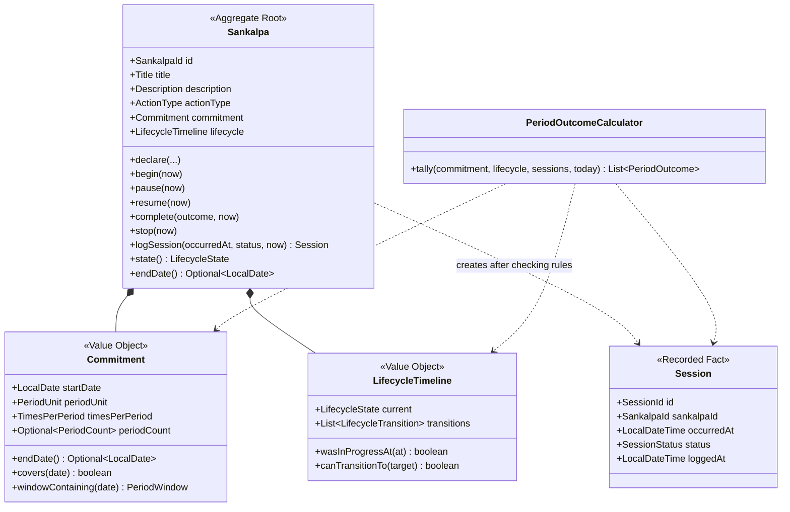

# 03 — Domain Model

The model follows the current requirements only. Open questions are listed in
[09-open-questions.md](09-open-questions.md) instead of being silently implemented.

## Overview



`Sankalpa` owns the rules about the commitment and lifecycle. `Session` is separate so the history
can grow without making the sankalpa aggregate unbounded.

## Aggregate: Sankalpa

```java
public final class Sankalpa {
    private final SankalpaId id;
    private final LocalDateTime declaredAt;
    private Title title;
    private Description description;
    private ActionType actionType;
    private Commitment commitment;
    private LifecycleTimeline lifecycle;

    public static Result<Sankalpa, DeclarationError> declare(Declaration declaration);

    public Result<Void, TransitionNotAllowed> begin(LocalDateTime now);
    public Result<Void, TransitionNotAllowed> pause(LocalDateTime now);
    public Result<Void, TransitionNotAllowed> resume(LocalDateTime now);
    public Result<Void, TransitionNotAllowed> complete(CompletionOutcome outcome, LocalDateTime now);
    public Result<Void, TransitionNotAllowed> stop(LocalDateTime now);

    public Result<Session, SessionNotLoggable> logSession(
        SessionId sessionId,
        LocalDateTime occurredAt,
        SessionStatus status,
        LocalDateTime now
    );
}
```

There are no edit or delete methods yet because the requirements do not include edit/delete use
cases.

## Aggregate/Record: Session

```java
public final class Session {
    private final SessionId id;
    private final SankalpaId sankalpaId;
    private final LocalDateTime occurredAt;
    private final SessionStatus status;
    private final LocalDateTime loggedAt;
}
```

A session records a past fact. It has no behavior beyond construction-time validity.

`Sankalpa.logSession(...)` creates sessions so the lifecycle and commitment rules stay with the
object that knows them.

## Value Object: Commitment

```java
public record Commitment(
    LocalDate startDate,
    PeriodUnit periodUnit,
    TimesPerPeriod timesPerPeriod,
    Optional<PeriodCount> periodCount
) {
    public Optional<LocalDate> endDate();
    public boolean covers(LocalDate date);
    public Optional<PeriodWindow> windowContaining(LocalDate date);
    public List<PeriodWindow> windowsElapsedAsOf(LocalDate today);
}
```

`PeriodCount` means duration is represented only as a whole number of periods. That directly follows
the requirement and avoids representing invalid duration shapes.

The exact inclusivity of `endDate()` is an open question because the requirements say "Start date +
duration" but do not say whether that date itself counts.

## Lifecycle

```java
public enum LifecycleState {
    NOT_STARTED,
    IN_PROGRESS,
    PAUSED,
    COMPLETED_SUCCESSFULLY,
    COMPLETED_UNSUCCESSFULLY,
    STOPPED
}

public record LifecycleTransition(
    LifecycleState from,
    LifecycleState to,
    LocalDateTime transitionedAt
) {}

public record LifecycleTimeline(
    LifecycleState current,
    List<LifecycleTransition> transitions
) {}
```

Allowed transitions:

| From \ To | Not started | In progress | Paused | Completed successfully | Completed unsuccessfully | Stopped |
|---|---|---|---|---|---|---|
| Not started | - | yes | no | yes | yes | yes |
| In progress | no | - | yes | yes | yes | yes |
| Paused | no | yes | - | yes | yes | yes |
| Completed successfully | no | no | no | - | no | no |
| Completed unsuccessfully | no | no | no | no | - | no |
| Stopped | no | no | no | no | no | - |

The transition table is domain logic. It should live in `LifecycleState` or `LifecycleTimeline`, not
in controllers or SQL.

## Period Outcomes

```java
public record PeriodOutcome(
    PeriodWindow window,
    int required,
    int performed,
    int missed,
    PeriodStanding standing
) {}

public enum PeriodStanding {
    OPEN,
    SATISFIED,
    UNSATISFIED
}
```

Period outcomes are derived, not stored.

Basic rule:

```java
boolean satisfied = performed >= required;
int missed = Math.max(0, required - performed);
```

Do not add `PAUSED`, prorating, streaks, scores, or projections until the requirements ask for them.

## Invariants

| # | Invariant | Enforced by |
|---|---|---|
| S1 | Title is present and not blank. | `Title` |
| S2 | Action type is one of the four requirement values. | `ActionType` |
| S3 | Start date is no more than one year before today. | `Sankalpa.declare` |
| S4 | Times per period is positive. | `TimesPerPeriod` |
| S5 | Duration, when present, is a whole number of periods. | `PeriodCount` on `Commitment` |
| S6 | End date is derived, not stored. | `Commitment.endDate()` |
| S7 | Lifecycle transitions follow the allowed table. | `LifecycleState` / `LifecycleTimeline` |
| S8 | Lifecycle transitions are audit logged. | `LifecycleTimeline` |
| S9 | A session may be logged only for a past moment. | `Sankalpa.logSession` |
| S10 | A session may be logged only while the sankalpa was In progress. | `Sankalpa.logSession` using `LifecycleTimeline` |

## Domain Errors

Use domain errors for business refusals:

- `InvalidTitle`
- `UnknownActionType`
- `InvalidTimesPerPeriod`
- `InvalidPeriodCount`
- `StartDateTooFarInPast`
- `InvalidLifecycleTransition`
- `SessionInFuture`
- `SessionOutsideCommitment`
- `SankalpaNotInProgressAtThatTime`
- `SankalpaNotFound`
- `InvalidCompletionOutcome`

These errors do not know HTTP status codes. Controllers map them to transport responses.
