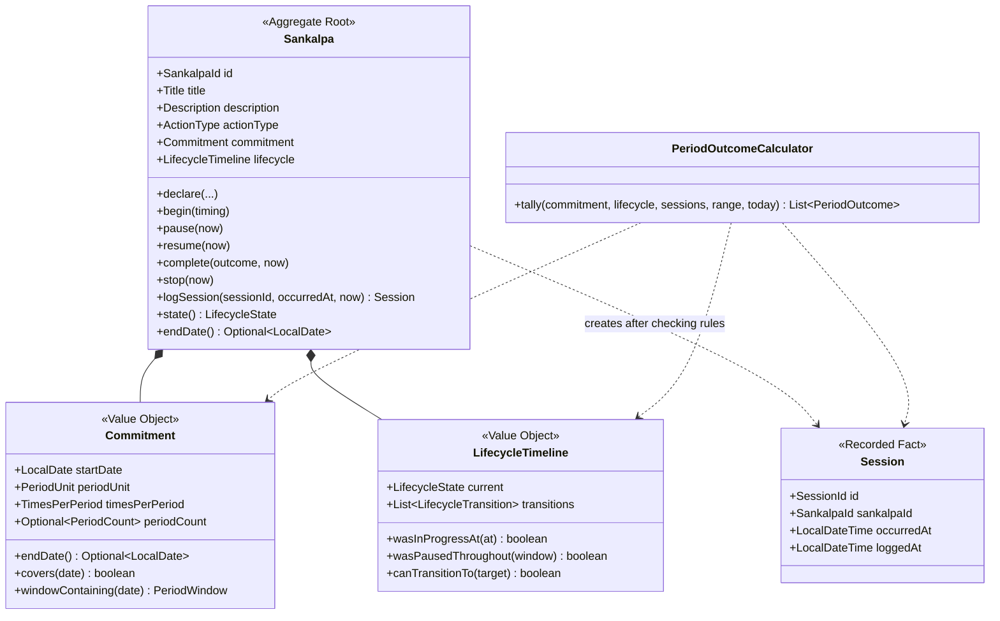

# 03 — Domain Model

The model follows the current requirements and accepted design decisions. Unresolved questions in
[09-open-questions.md](09-open-questions.md) remain outside the design.

## Overview



`Sankalpa` owns the rules about the commitment and lifecycle. `Session` is separate so the history
can grow without making the sankalpa aggregate unbounded.

## Aggregate: Sankalpa

```java
public final class Sankalpa {
    private final SankalpaId id;
    private final LocalDateTime declaredAt;
    private Title title;
    private Description description;
    private ActionType actionType;
    private Commitment commitment;
    private LifecycleTimeline lifecycle;

    public static Result<Sankalpa, DeclarationError> declare(Declaration declaration);

    public Result<Void, LifecycleTransitionError> begin(BeginTiming timing);
    public Result<Void, LifecycleTransitionError> pause(LocalDateTime now);
    public Result<Void, LifecycleTransitionError> resume(LocalDateTime now);
    public Result<Void, LifecycleTransitionError> complete(
        CompletionOutcome outcome, LocalDateTime now);
    public Result<Void, LifecycleTransitionError> stop(LocalDateTime now);

    public Result<Session, SessionNotLoggable> logSession(
        SessionId sessionId,
        LocalDateTime occurredAt,
        LocalDateTime now
    );
}
```

There is no session edit method. Permanent deletion is an application operation over a separate
session fact, so it does not belong on the `Sankalpa` aggregate. The application first verifies the
session identity's owner, then the persistence transaction removes the fact and reserves the
identity as deleted.

## Aggregate/Record: Session

```java
public final class Session {
    private final SessionId id;
    private final SankalpaId sankalpaId;
    private final LocalDateTime occurredAt;
    private final LocalDateTime loggedAt;
}
```

A session records a past fact. It has no behavior beyond construction-time validity.

`Sankalpa.logSession(...)` creates sessions so the lifecycle and commitment rules stay with the
object that knows them.

Deletion physically removes this fact. A separate technical identity ledger retains only the ID,
owner, and `DELETED` state so a delayed create cannot resurrect it. That ledger is application and
persistence state, not a soft-deleted `Session` domain object.

## Value Object: Commitment

```java
public record Commitment(
    LocalDate startDate,
    PeriodUnit periodUnit,
    TimesPerPeriod timesPerPeriod,
    Optional<PeriodCount> periodCount
) {
    public Optional<LocalDate> endDate();
    public boolean covers(LocalDate date);
    public Optional<PeriodWindow> windowContaining(LocalDate date);
    public List<PeriodWindow> windowsStartingBetween(LocalDate from, LocalDate until);
}
```

`PeriodCount` means duration is represented only as a whole number of periods. That directly follows
the requirement and avoids representing invalid duration shapes.

`endDate()` is inclusive. For a commitment of `n` periods, it is the start of period `n + 1` minus
one day. For example, one DAY beginning January 1 ends January 1, and one WEEK beginning January 1
ends January 7. Every boundary is calculated from the original start date plus its period index,
not by advancing the previously adjusted boundary. A January 31 monthly commitment therefore has
boundaries on January 31, February 28 (or 29), March 31, and April 30 rather than drifting to the
28th. `covers(date)` and `PeriodWindow` use the same inclusive boundary.

## Lifecycle

```java
public enum LifecycleState {
    NOT_STARTED,
    IN_PROGRESS,
    PAUSED,
    COMPLETED_SUCCESSFULLY,
    COMPLETED_UNSUCCESSFULLY,
    STOPPED
}

public record LifecycleTransition(
    LifecycleState from,
    LifecycleState to,
    LocalDateTime effectiveAt,
    LocalDateTime recordedAt
) {}

public record BeginTiming(
    LocalDateTime effectiveAt,
    LocalDateTime recordedAt
) {}

public record LifecycleTimeline(
    LifecycleState current,
    List<LifecycleTransition> transitions
) {}
```

Allowed transitions:

| From \ To | Not started | In progress | Paused | Completed successfully | Completed unsuccessfully | Stopped |
|---|---|---|---|---|---|---|
| Not started | - | yes | no | yes | yes | yes |
| In progress | no | - | yes | yes | yes | yes |
| Paused | no | yes | - | yes | yes | yes |
| Completed successfully | no | no | no | - | no | no |
| Completed unsuccessfully | no | no | no | no | - | no |
| Stopped | no | no | no | no | no | - |

The transition table is domain logic. It should live in `LifecycleState` or `LifecycleTimeline`, not
in controllers or SQL.

`effectiveAt` is when the lifecycle change took effect; `recordedAt` is when the user performed and
recorded it. Only Begin may have different values. Its effective time may be in the past, but not
before the commitment start or in the future. Pause, Resume, Complete, and Stop always use the
clock's current time for both values. Because the only backdated transition is the first transition,
later lifecycle changes cannot rewrite the eligibility of a session accepted by an earlier,
committed command. No historical cross-aggregate transition policy or latest-session lookup is
needed. Concurrent session and lifecycle commands still need a single commit order at the
persistence boundary so neither validates against a stale lifecycle snapshot.

Reaching a finite commitment's end date does not change lifecycle state. Commitment coverage and
lifecycle answer different questions: coverage says whether a timestamp belongs to the commitment;
lifecycle says whether action was active at that timestamp. A session is eligible only when both
are true.

## Period Outcomes

```java
public record PeriodOutcome(
    PeriodWindow window,
    int required,
    int performed,
    int missed,
    PeriodStanding standing
) {}

public enum PeriodStanding {
    OPEN,
    PAUSED,
    SATISFIED,
    UNSATISFIED
}
```

Period outcomes are derived, not stored.

For a closed, non-paused period, performed sessions determine the arithmetic:

```java
boolean satisfied = performed >= required;
int missed = Math.max(0, required - performed);
```

A window is `PAUSED` only when the sankalpa was Paused for the entire window. Otherwise an unclosed
window is `OPEN`; a closed window is `SATISFIED` or `UNSATISFIED`. A partially paused window keeps
its original boundaries and full requirement, and tracking resumes within that same window. There
is no proration or end-date extension. A fully Paused period is not evaluated as satisfied or
unsatisfied, and its derived `missed` value is zero.

For a finite commitment that reaches its end date, all of its closed period windows may be
evaluated even if lifecycle remains In progress. Completed or Stopped is always a reporting cutoff:
only complete windows ending before that transition are evaluated. The interrupted window and all
later windows are omitted. Session history remains available independently of period outcomes.

The calculator evaluates only windows whose start dates fall in the requested date range. The
application loads sessions from the first selected window's start through the last selected
window's end, so a range that begins partway through a week or month cannot undercount that window.
This keeps an indefinite daily commitment from loading and materializing its entire history for
every query.

## Invariants

| # | Invariant | Enforced by |
|---|---|---|
| S1 | Title is present and not blank. | `Title` |
| S2 | Action type is one of the four requirement values. | `ActionType` |
| S3 | Start date is no more than one year before today. | `Sankalpa.declare` |
| S4 | Times per period is positive. | `TimesPerPeriod` |
| S5 | Duration, when present, is a whole number of periods. | `PeriodCount` on `Commitment` |
| S6 | End date is derived, inclusive, and not stored. | `Commitment.endDate()` |
| S7 | Lifecycle transitions follow the allowed table. | `LifecycleState` / `LifecycleTimeline` |
| S8 | Lifecycle transitions record both effective and recorded time. | `LifecycleTimeline` |
| S9 | A session may be logged only for a past moment. | `Sankalpa.logSession` |
| S10 | A session may be logged only within commitment coverage and while the sankalpa was In progress. | `Sankalpa.logSession` using `Commitment` and `LifecycleTimeline` |
| S11 | A backdated Begin is not future-effective or before the commitment start. | `LifecycleTimeline` |
| S12 | Missed count is derived from required minus performed and cannot be negative. | `PeriodOutcomeCalculator` |
| S13 | A partially paused period is evaluated normally; a fully paused period is reported as Paused. | `PeriodOutcomeCalculator` |
| S14 | Only Begin may be backdated; all other transitions take effect when recorded. | `LifecycleTimeline` |
| S15 | Reaching the end date does not automatically change lifecycle state. | `Sankalpa` / application behavior |
| S16 | A terminal transition excludes the interrupted and later windows from evaluation. | `PeriodOutcomeCalculator` |
| S17 | One logging identity can create at most one session; an exact retry returns it. | Application service plus session-identity ledger |
| S18 | Different identities remain different sessions even at the same performed-at time. | `SessionId` identity; no value-based uniqueness rule |
| S19 | A deleted identity can never become active again. | `DeleteSession` transaction plus identity ledger |
| S20 | Deleted sessions contribute to no history, total, or open/closed period calculation. | Physical removal and active-session read ports |

## Domain Errors

Use domain errors for business refusals:

- `InvalidTitle`
- `UnknownActionType`
- `InvalidTimesPerPeriod`
- `InvalidPeriodCount`
- `StartDateTooFarInPast`
- `LifecycleTransitionError`
  - `InvalidLifecycleTransition`
  - `TransitionInFuture`
  - `TransitionBeforeStart`
- `SessionInFuture`
- `SessionOutsideCommitment`
- `SankalpaNotInProgressAtThatTime`
- `InvalidCompletionOutcome`

These errors do not know HTTP status codes. Controllers map them to transport responses.
