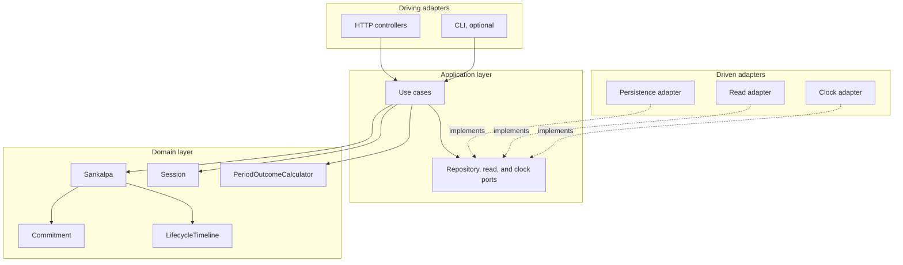

# Sankalpa — Domain-Driven Architecture

This folder describes a lean domain model and ports-and-adapters architecture for
[docs/requirements/sankalpa.md](../../requirements/sankalpa.md).

The reference material in `/Users/prashantwani/wrk/computer-setup/ai/reference/ddd-hexagonal/`
is used as guidance, not as a rulebook. Patterns are included only when they pay for themselves in
this project.

## Domain Vision

Sankalpa helps a user record a declared intent, track sessions against that commitment, and see
whether each period was satisfied.

The value is in the commitment arithmetic and lifecycle rules, not in elaborate architecture.

## Reading Order

| # | Document | What it answers |
|---|---|---|
| 01 | [Strategic design](01-strategic-design.md) | Why this is one bounded context and not a set of subdomains |
| 02 | [Ubiquitous language](02-ubiquitous-language.md) | Terms used by the requirements and the model |
| 03 | [Domain model](03-domain-model.md) | Aggregates, value objects, invariants, lifecycle, errors |
| 04 | [Recorded facts](04-recorded-facts.md) | Audit/history without speculative event infrastructure |
| 05 | [Application layer](05-application-layer.md) | Use cases, ports, commands, queries |
| 06 | [Hexagonal architecture](06-hexagonal-architecture.md) | Package shape, adapters, persistence |
| 07 | [Design decisions](07-design-decisions.md) | Decisions kept, decisions removed, and why |
| 08 | [Testing strategy](08-testing-strategy.md) | Tests proportional to the model |
| 09 | [Open questions](09-open-questions.md) | Requirement gaps that should not be silently designed in |
| 10 | [Possible requirement amendments](10-requirement-amendments.md) | Optional clarifications before expanding scope |

## Architecture At A Glance

## Current Scope

Included because the requirements need it:

- One bounded context: `Sankalpa`.
- A `Sankalpa` aggregate for commitment and lifecycle rules.
- A separate `Session` record/aggregate so session history can grow without bloating `Sankalpa`.
- Value objects only for values with rules: commitment, period unit/count, number of times, title,
  description, period windows, lifecycle timeline.
- A period-outcome calculator because the result spans commitment, lifecycle, and sessions.
- Ports around persistence, reads, and time.

Deliberately not included yet:

- Separate subdomains or bounded contexts.
- Domain events, event dispatcher, outbox, process manager, command bus, or integration events.
- Identity, ownership, activity catalogue, reminders, notifications, streaks, scoring, social
  features, edit/delete flows, or per-sankalpa time zones.
- DDD specification objects where a method or named helper is clearer.

## Requirements Traceability

| Requirement | Carried by |
|---|---|
| Title and description | `Title`, `Description` |
| Start date, optional duration, derived end date | `Commitment` |
| Action type, period, number of times | `ActionType`, `PeriodUnit`, `TimesPerPeriod` |
| Duration must be a whole number of periods | `PeriodCount`; no other duration shape is represented |
| More than the number of times still satisfies | `PeriodOutcomeCalculator` compares performed count with a minimum |
| Session date/time and status | `Session` |
| Log only past sessions while In progress | `Sankalpa.logSession`, `LifecycleTimeline` |
| Start date can be up to one year in the past | `Sankalpa.declare` |
| No duration means tracked until stopped | `Commitment` plus terminal lifecycle state |
| Lifecycle states and allowed transitions | `LifecycleState` transition table |
| Lifecycle transitions audit logged | `LifecycleTimeline` |
| Time spent Paused does not extend end date | `Commitment.endDate()` is derived, not stored |

Anything not in this table is either an implementation concern or an open question.
