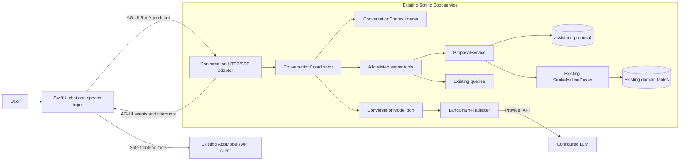

# Conversational Sankalpa — Detailed Design

**Status:** Proposed for implementation  
**Last reviewed:** 2026-09-24  
**Scope:** Native iOS client and the existing Spring Boot service

## 1. Decision

Add an online conversational interface that accepts typed or transcribed text, interprets it on the
server, and helps the user inspect the practice, log a session, or declare a Sankalpa.

The implementation remains one iOS application, one Spring Boot service, and one SQLite database:

- iOS and the service communicate through a deliberately small, pinned subset of AG-UI over HTTP
  and Server-Sent Events (SSE).
- The service uses LangChain4j behind an application-owned `ConversationModel` port.
- The model may request a small allowlist of typed server tools. It never receives database,
  arbitrary HTTP, filesystem, or generic code-execution tools.
- Read tools return bounded context. Write-oriented tools create proposals only.
- A proposal changes no domain state. The user must confirm it through an AG-UI interrupt/resume
  exchange.
- The service then invokes the existing `SankalpaUseCases`; it does not ask the model to perform or
  validate the mutation.
- iOS tools are safe presentation effects only: refresh, navigate, and open an existing native
  screen.
- MCP is not part of the first implementation. It becomes useful only if a separate AI host must
  discover and invoke Sankalpa capabilities.

This is a conversational adapter over the existing application, not a second domain model and not
an autonomous agent platform.

## 2. Why this shape

The model is useful for interpreting phrases such as “I went to the gym this morning” or “I want
to meditate every day.” It is not a source of truth for lifecycle eligibility, commitment dates,
session identity, or persistence.

The split is therefore:

| Concern | Owner |
|---|---|
| Speech recognition and editable transcript | iOS |
| Conversation presentation | iOS |
| Natural-language interpretation | Server model adapter |
| Tool allowlist and orchestration | Server application layer |
| Proposal validation and expiry | Server application layer |
| Domain invariants and mutation | Existing `SankalpaUseCases` and domain |
| Authoritative state | Existing server database |
| Post-action screen refresh | Existing iOS service client |

## 3. Goals

1. Understand natural descriptions without duplicating the domain in keyword matching code.
2. Make every consequential action visible and confirmable before execution.
3. Preserve all existing domain rules, idempotency guarantees, and server authority.
4. Give the user an explicit state at all times: listening, ready to send, understanding,
   clarification needed, awaiting confirmation, completed, or failed.
5. Keep framework and model-provider choices replaceable.
6. Remain deployable as the existing Spring Boot artifact with SQLite.
7. Make failures safe: a failed model call or broken stream must not partially mutate the practice.

## 4. Non-goals

- A general-purpose personal assistant.
- Autonomous or background execution.
- A Python sidecar, LangGraph workflow, Redis, a vector database, or Kubernetes.
- Dynamic UI generation, A2UI, arbitrary client code execution, or model-generated SwiftUI.
- Model access to SQL, files, shell commands, URLs, or secrets.
- MCP in the first release.
- Sankalpa edit or delete, because those are not current product requirements.
- Uploading microphone audio to the service. iOS sends the final text transcript.
- Offline conversational interpretation. Existing manual and offline-safe paths remain available.

## 5. First-release capabilities

### Included

- Answer bounded questions using current Sankalpa summaries.
- List or navigate to Sankalpas.
- Propose and confirm a session log.
- Propose and confirm a new Sankalpa declaration.
- Ask a concise clarification when a required fact is missing or a match is ambiguous.
- Correct or cancel a pending proposal. Correction first cancels the pending proposal, then sends
  the correction as a new ordinary message.
- Recover safely from model, network, validation, and refresh failures.

### Deferred

- Conversational Begin, Pause, Resume, Complete, and Stop.
- Conversational session deletion or Undo.
- Long-term semantic memory, embeddings, RAG, or cross-user knowledge.
- External agent clients through MCP.

Deferred lifecycle capabilities can later use the same proposal/confirmation boundary. They do not
require a new transport or agent framework.

## 6. Architecture at a glance

## 7. Normal interaction

1. The user speaks or types in the chat composer.
2. iOS sends a standard AG-UI `RunAgentInput` with a client-generated `threadId` and `runId`.
3. The server loads a bounded, current catalog of relevant Sankalpas before calling the model.
4. The model answers directly, asks a question, or requests one allowlisted tool or frontend effect.
5. A proposal tool validates and persists a non-mutating proposal.
6. The server ends the run with an AG-UI interrupt containing the typed proposal.
7. iOS renders a native confirmation card from that known proposal type.
8. Confirm or Cancel is sent as an AG-UI `resume` entry in a new run. Editing uses the existing
   native form; a conversational correction cancels first and starts a new run only after that
   cancellation succeeds.
9. On Confirm, the server locks and revalidates the proposal and invokes the existing use case in
   the same transaction that marks the proposal executed.
10. The server emits a result message and safe client tools such as `refresh_practice` and
    `navigate_to_sankalpa`.
11. iOS refreshes the authoritative state. It never constructs domain state from model output.

## 8. Core safety rules

1. **No confirmation, no mutation.** A normal prompt run cannot change Sankalpa domain state.
2. **The model proposes; application code decides.** Tool arguments are untrusted input.
3. **Confirmation is bound to one persisted proposal.** The client cannot substitute new values in
   the confirmation payload.
4. **Every confirmation is idempotent.** Replaying it returns the recorded outcome.
5. **Revalidate at execution.** State may change between proposal and confirmation.
6. **The service is authoritative.** iOS refreshes after a successful action.
7. **Unknown tools fail closed.** Neither server nor iOS executes an unregistered tool.
8. **Stored content is untrusted.** Sankalpa titles and descriptions are data, never instructions.
9. **One active run per thread.** A second send is disabled until the run ends or is cancelled.
10. **Bound every loop.** Model rounds, tool calls, context size, response size, and deadlines have
    explicit limits.
11. **One model tool request per turn.** A model response containing multiple tool requests is
    rejected before any tool executes.

## 9. Product behavior decisions

- Speech is an input method for the ordinary chat composer. When listening stops, the recognized
  text remains editable and the UI clearly offers **Send**. There is no hidden wait for automatic
  submission.
- Relative dates are interpreted using the server's configured `SANKALPA_TIMEZONE` and clock.
- “Now” and “just finished” use the server request time. A past date or a named part of day without
  an exact time requires clarification; the system does not invent 9:00 AM.
- A declaration without a start date defaults to today and shows that choice in confirmation.
- A declaration without duration is open-ended, matching the current domain.
- “Every morning” maps to once per day. Morning may appear in the title or description, but no
  reminder time is stored because the current domain has no reminder-time field.
- Durations that cannot be represented exactly as a whole number of the selected period require
  clarification rather than silent conversion.
- Every session and declaration proposal names the exact values that will be committed.
- Conversational declaration titles are limited to 200 characters and descriptions to 2,000
  characters so every accepted proposal can be displayed and transported safely.

## 10. Framework choices

### LangChain4j

Use LangChain4j's low-level chat/tool-specification API inside Spring Boot. Do not use automatic
`@Tool` execution or the experimental agentic module. The application must see each requested tool
before execution so it can validate the allowlist, enforce limits, and stop immediately on a
proposal. LangChain4j is an adapter, not the architecture.

The `ConversationModel` port prevents tool annotations, provider response types, or prompt storage
from entering the domain or existing application interfaces.

### AG-UI

Implement a small native Swift `AGUIClient` with `Codable` event types and `URLSession` streaming.
Pin an exact AG-UI release or commit during implementation and keep upstream conformance fixtures
in tests. Do not implement the entire evolving protocol.

Use:

- lifecycle events;
- text message events;
- tool call events for safe frontend effects;
- `RunFinished` interrupt outcomes and `RunAgentInput.resume` for approval;
- optionally `MessagesSnapshot` when restoring a local transcript becomes necessary.

Do not use reasoning, subagent, activity, state-delta, generative UI, or custom events in v1.
The model response itself may initially arrive as one complete text chunk; AG-UI compatibility
does not require token-by-token model streaming.

### MCP

Do not expose MCP merely to let code in the same process call other code in the same process.
Ordinary typed Java interfaces are simpler. If an independent AI host later needs Sankalpa, add a
thin MCP adapter that calls the same proposal and application services. Do not put business rules
in that adapter.

## 11. Documentation map

| Document | Contents |
|---|---|
| [requirements.md](requirements.md) | Proposed conversational requirements and traceability |
| [user-journeys.md](user-journeys.md) | Happy paths, ambiguity, correction, retry, and failure journeys |
| [architecture.md](architecture.md) | Components, state machine, proposal storage, tools, security, and deployment |
| [contracts.md](contracts.md) | AG-UI profile, internal tool contracts, frontend tools, and error contracts |
| [testing-and-validation.md](testing-and-validation.md) | Tests, model evaluations, acceptance gates, and rollout |
| [design-review.md](design-review.md) | Design → Review → Fix record and final validation |

## 12. Implementation sequence

1. Add the model-independent conversation coordinator, proposal model, outer transaction boundary,
   and fake model adapter.
2. Add the AG-UI server adapter and contract fixtures.
3. Add the native Swift AG-UI client and text-only chat UI.
4. Implement session-log proposals and confirmation using a fake model.
5. Add declaration proposals.
6. Add LangChain4j and the configured model provider behind `ConversationModel`.
7. Add iOS speech transcription to the existing composer.
8. Add security, operational configuration, model evaluations, and staged enablement.

The first five steps prove all correctness and protocol behavior without depending on model
quality. The model adapter is integrated only after deterministic behavior is covered.

## 13. External references

- [AG-UI event model](https://docs.ag-ui.com/concepts/events)
- [AG-UI core types](https://github.com/ag-ui-protocol/ag-ui/blob/main/sdks/typescript/packages/core/src/types.ts)
- [LangChain4j AI Services](https://docs.langchain4j.dev/tutorials/ai-services/)
- [LangChain4j tool calling](https://docs.langchain4j.dev/tutorials/tools/)
- [MCP architecture](https://modelcontextprotocol.io/docs/learn/architecture)
- [OpenAI function-calling flow and strict schemas](https://developers.openai.com/api/docs/guides/function-calling)

The OpenAI reference is used for the provider-neutral execution rule reflected here: a model emits
a typed request, application code validates and executes it, and the result is returned separately.
The design does not depend on an OpenAI-specific client type.
