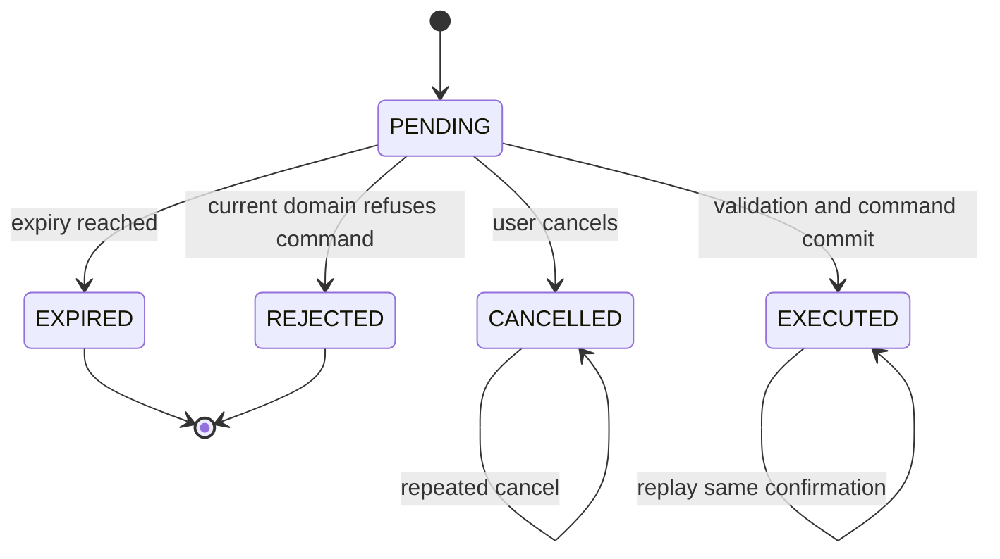
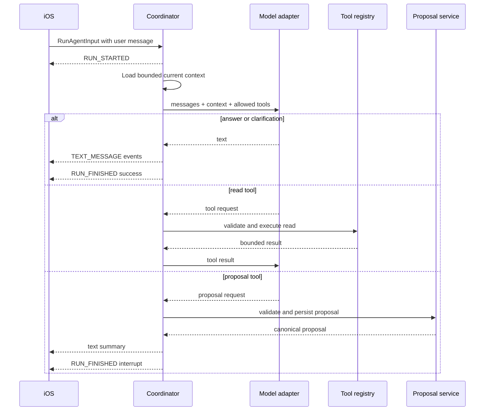
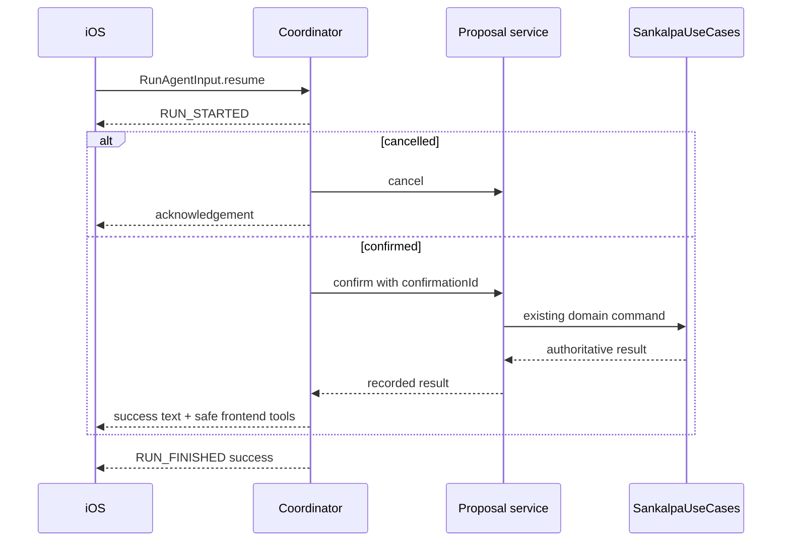

# Architecture

## 1. Architectural boundaries

The conversational capability is a new driving adapter plus an application coordinator. It does
not change the domain model and does not bypass the existing application layer.

```text
adapter/in/conversation     AG-UI HTTP/SSE parsing and event encoding
application/conversation    Coordinator, proposal service, tool registry, model port
adapter/out/llm             LangChain4j implementation of the model port
adapter/out/persistence     Proposal persistence beside existing JDBC adapter
domain                      Unchanged
application/SankalpaUseCases Existing authoritative commands and queries
```

The iOS equivalent is:

```text
SankalpaCore/Sources/SankalpaConversation
  AGUI/                     Pinned protocol types and SSE decoder
  ConversationClient.swift Transport and run lifecycle
  ConversationModels.swift Local transcript/proposal presentation models

Sankalpa/UI/Assistant
  AssistantView.swift
  AssistantViewModel.swift
  ProposalCards.swift
  SpeechComposer.swift
  FrontendToolRegistry.swift
```

`SankalpaConversation` depends on Foundation and existing storage/application interfaces, not
SwiftUI. The UI target supplies concrete frontend tool handlers.

## 2. Server components

### `ConversationController`

- Accepts `POST /api/v1/assistant/runs`.
- Authenticates before reading the body or opening a model stream.
- Validates the pinned AG-UI input profile and request limits.
- Delegates to `ConversationCoordinator`.
- Encodes only supported AG-UI events as `text/event-stream`.
- Maps failures to stable run error codes without exposing prompts or provider details.

Use Spring MVC `SseEmitter` with a bounded assistant executor. Do not migrate the service to
WebFlux for this feature. The controller emits `RUN_STARTED` promptly; model text may be delivered
as one `TEXT_MESSAGE_CONTENT` event in v1.

### `ConversationCoordinator`

- Enforces one active run for a `threadId` within this service instance.
- Loads current time and a bounded Sankalpa catalog before model invocation.
- Builds application-owned instructions and tool specifications.
- Before model invocation, replays a proposal already created by the same `runId`; otherwise rejects
  ordinary input when the thread has a pending proposal.
- Runs at most three model rounds and three total model tool requests.
- Accepts at most one tool request in a model response. If a response contains multiple requests,
  it executes none and ends with `ASSISTANT_COULD_NOT_INTERPRET`.
- Rejects unknown, malformed, or disallowed tool requests.
- Converts model text into AG-UI message events.
- Converts a persisted proposal into an AG-UI interrupt outcome.
- Handles `resume` entries without invoking the model when a deterministic confirmation or
  cancellation is sufficient.
- Generates action-success messages from recorded application results; model text can never be the
  evidence that a mutation succeeded.

The active-run guard has a deadline and is always released in `finally`; a disconnected client
cannot leave a thread permanently busy.

### `ConversationModel` port

Conceptual interface:

```java
public interface ConversationModel {
    ModelTurn respond(ModelRequest request);
}

public record ModelRequest(
    List<ConversationMessage> messages,
    ConversationContext context,
    List<ModelToolDefinition> tools,
    int remainingToolCalls
) {}

public sealed interface ModelTurn
    permits TextTurn, ToolRequestTurn, RefusalTurn {}
```

The application owns these types. Provider response objects and LangChain4j types do not cross
the adapter boundary.

### `LangChain4jConversationModel`

- Uses LangChain4j's low-level chat model and tool-specification APIs, not automatic `@Tool`
  execution and not the experimental agentic module.
- Returns tool requests to `ConversationCoordinator`; the adapter never invokes application code.
- Uses strict schemas where supported.
- Sends only the bounded conversation, context, and tools supplied by the coordinator.
- Applies provider timeouts and cancellation.
- Maps provider refusal, rate limit, timeout, invalid output, and transport errors into application
  failures.
- Does not persist provider conversation IDs as domain data.

### Prompt contract

The prompt is versioned alongside the tool schemas and built from fixed sections:

1. role and supported capabilities;
2. rules that tools are requests, not evidence of execution;
3. required clarification and confirmation behavior;
4. current server date, time, and timezone;
5. bounded Sankalpa data clearly delimited as untrusted data;
6. fixed tool descriptions and limits;
7. instruction to be concise and never expose hidden reasoning.

Use low-variance provider settings where supported. A model or prompt version change is a release
change that must pass the evaluation corpus; it is not an untracked environment tweak.

### `ConversationContextLoader`

Loads a compact catalog from the server, not the phone cache:

```text
id, title, bounded description snippet, actionType, lifecycle state,
start date, derived end date, period unit, times per period
```

Titles are capped at the domain's 200-character limit. Description snippets are capped at 500
characters and carry a `descriptionTruncated` flag; the model may use `get_sankalpa` when the full
bounded conversational description is needed. Existing descriptions longer than 2,000 characters
are never sent to the model in full.

For session logging, it also provides whether the Sankalpa could be eligible near the interpreted
date. Final eligibility is still checked by domain code.

The initial implementation loads the single user's current catalog on every run, including
finished Sankalpas because a historical session may still be loggable. If the catalog exceeds its
configured bound, the run fails visibly rather than silently omitting candidates. A deterministic
search tool is added only when real data demonstrates that need.

### `ConversationToolRegistry`

Every model-visible tool or frontend effect is registered in code with:

- stable name and version;
- description;
- strict input and output schema;
- `READ`, `PROPOSAL`, or `FRONTEND_EFFECT` classification;
- authorization policy;
- timeout;
- maximum result size;
- handler.

There is no dynamic tool discovery in v1.

The model receives the internal registry plus the safe frontend effects advertised by iOS and
allowed by the server. A request is classified before execution as exactly one of `READ`,
`PROPOSAL`, or `FRONTEND_EFFECT`. `refresh_practice` is not exposed to the model; the coordinator
emits it deterministically after a successful mutation. `navigate_to_sankalpa` validates that its
ID is in current context, and `open_sankalpa_list` accepts no arguments.

### `ProposalService`

- Validates tool arguments independently of the model.
- Computes derived values through domain objects. Session proposal validation uses a
  side-effect-free domain eligibility method shared by `Sankalpa.logSession`; it must not duplicate
  the eligibility rules in the conversation package.
- Persists a non-mutating proposal.
- Resolves confirmation/cancellation under a row lock or equivalent transaction ordering.
- Revalidates current domain state immediately before command execution.
- Invokes the existing application use case.
- Records the final result so the same confirmation is replay-safe.

### Transaction ownership

`TransactionalConversationUseCases` is the single outer transaction boundary for proposal
creation, cancellation, and confirmation. On confirmation it acquires SQLite's write reservation
with a no-op update of the proposal row before reading its state, mirroring the existing
`findByIdForUpdate` pattern. It then calls `ProposalService`, whose call to the transactional
`SankalpaUseCases` joins the same Spring transaction. The proposal row, Sankalpa/session write, and
recorded result therefore commit or roll back together. The transaction never spans a model or
network call.

## 3. Model tool boundary

### Read tools

Read tools may call existing queries and return bounded DTOs:

- `get_sankalpa(id)`
- `get_recent_sessions(sankalpaId, from, until, limit)`
- `get_period_summary(sankalpaId, from, until, limit)`

`list_sankalpas` is not initially required because the catalog is always supplied. It may be added
if catalog pagination becomes necessary.

### Proposal tools

- `propose_log_session`
- `propose_declare_sankalpa`

Proposal tools can write only `assistant_proposal`. They cannot modify Sankalpa, lifecycle, or
session tables.

A successful proposal tool is terminal for that model run. The coordinator does not send the
proposal back to the model for another prose response; it generates the short proposal summary and
interrupt from canonical server data. Read-tool results may be returned to the model for a bounded
follow-up round.

A successful frontend-effect request is also terminal for the model run. The coordinator validates
it, emits the corresponding AG-UI tool-call events, and finishes the run. A model response with more
than one request is rejected before any read, proposal, or frontend effect executes.

### Explicitly forbidden tools

- generic SQL or repository access;
- arbitrary HTTP fetch;
- filesystem, shell, or code execution;
- a direct `create_sankalpa` or `log_session` available during interpretation;
- secret retrieval;
- a tool name or schema supplied by the iOS client.

The `tools` array in incoming AG-UI input is ignored for server capability selection. The server
publishes its own fixed registry. Client-provided tools describe only safe frontend effects the
server may request.

## 4. Proposal model

### Persistence

Add one technical table:

| Column | Purpose |
|---|---|
| `proposal_id` | UUID primary key and AG-UI interrupt ID |
| `thread_id` | Owning conversation thread |
| `source_run_id` | Run that created the proposal; unique for replay |
| `kind` | `LOG_SESSION` or `DECLARE_SANKALPA` |
| `schema_version` | Version of the strict proposal payload |
| `payload_json` | Canonical validated values, never raw model arguments |
| `status` | Proposal state |
| `confirmation_id` | First accepted confirmation identity, nullable and unique |
| `result_resource_id` | Created session or Sankalpa ID after success |
| `failure_code` | Stable final refusal code, nullable |
| `created_at` | Server time |
| `expires_at` | Server time |
| `resolved_at` | Server time, nullable |

Raw prompts, chain-of-thought, API keys, and provider payloads are not stored in this table.

### States



Only `PENDING` can transition to a new final state. `EXECUTED` is replayable but immutable.

### Confirmation transaction

1. Parse the interrupt and confirmation IDs.
2. Lock/read the proposal.
3. Require matching `threadId`, kind, and schema version.
4. If already `EXECUTED` with the same confirmation ID, return the recorded result.
5. Reject a different confirmation ID against a resolved proposal.
6. Require `PENDING` status and check expiry.
7. Rebuild typed domain inputs from canonical proposal data.
8. Revalidate current domain state.
9. Invoke the existing application use case.
10. Mark `EXECUTED` and store the resource ID in the same database transaction.

For session logging, the proposal also contains the stable session ID required by the separate
session-reliability design. For declaration, the proposal transaction and Sankalpa insert share the
same SQLite transaction, so a crash cannot commit one without recording the other.

If a transport retry repeats a `runId` that already created a proposal, the coordinator replays the
same proposal interrupt instead of invoking the model or creating another proposal. The proposal ID
is the interrupt ID, and the proposal-summary message ID is deterministically derived from the
source run ID, so iOS can discard events it already received before a disconnect.

## 5. Conversation state

The iOS client owns the displayed transcript and stores a bounded copy locally. Each run sends the
bounded relevant message history required by AG-UI. The server does not need a second message
database in v1.

The local transcript uses iOS data protection, is omitted from device logs/backups where the app's
storage policy requires it, and can be cleared by the user without deleting practice data.

The server persists proposals because they are security and idempotency boundaries. It does not
persist every token or assistant message.

Transcript bounds:

- keep at most the latest 20 conversational messages for a model request;
- always include an unresolved proposal summary when continuing that proposal;
- when the user types a correction while a proposal is pending, iOS first sends an idempotent
  cancellation resume. Only after cancellation succeeds does it start an ordinary run containing
  the correction; the prior canonical proposal summary remains in the bounded history;
- summarize older display-only messages locally if a future requirement needs long threads;
- never allow client messages to replace server instructions or tool definitions.

## 6. Orchestration

### Interpretation run



### Resume run

The coordinator handles confirmation or cancellation directly. A model call is not necessary to
decide whether a stored proposal should execute.



## 7. iOS design

### `AssistantViewModel`

Owns a small deterministic UI state:

```text
idle
listening(partialTranscript)
readyToSend(transcript)
running(runId)
awaitingConfirmation(proposal)
resolvingProposal(runId, queuedFollowUp)
failed(retryableMessage)
```

State transitions are covered without a live server. A stale callback from an older run cannot
modify the current state.

While `awaitingConfirmation`, the composer remains usable. Sending text produces the documented
cancel-then-send sequence. Confirm and Cancel produce their corresponding resume forms. The second
run never starts until cancellation has completed, so new input cannot race an open interrupt. The
queued correction or Edit action remains local while `resolvingProposal` and proceeds only after
the cancellation acknowledgement.

### `AGUIClient`

- Encodes the pinned `RunAgentInput` subset.
- Reads SSE incrementally and rejects oversized or malformed events.
- Requires `RUN_STARTED` first and exactly one terminal lifecycle event.
- Correlates message IDs, tool-call IDs, thread IDs, and run IDs.
- Treats EOF before a terminal event as an interrupted run.
- Preserves unknown optional event fields but ignores unsupported event types safely.
- Never executes a tool until `TOOL_CALL_END` produced valid complete JSON.

### Frontend tool registry

The registry is compile-time allowlisted. Each handler validates arguments again before calling
existing app behavior. Unknown names, malformed arguments, and invalid UUIDs produce a local tool
failure; they never invoke arbitrary selectors or reflection.

After executing a frontend tool, iOS records a local AG-UI tool message containing only success or
a bounded error code. It includes that message in later bounded history but does not automatically
start another model run. Frontend-tool failure never retries the already-committed domain command.

### Speech

Speech recognition is an input adapter only:

- start/stop is explicit;
- partial recognition updates the composer;
- final recognition never submits automatically;
- the user can edit before sending;
- cancellation releases the audio session;
- chat remains fully usable without microphone or speech permission.

## 8. Time, ambiguity, and matching

- The server clock and configured timezone are included in model context as data.
- The model returns canonical ISO local dates/times only through strict tool arguments.
- Domain code parses and validates every value.
- A hallucinated Sankalpa ID is rejected because it is absent from the current catalog.
- If the user gives an exact timestamp, use it.
- If the user says now/just finished, use request receipt time.
- If the user gives a past date or named daypart without exact time, ask for time.
- If the model identifies multiple plausible targets, ask the user to choose.
- A model match is never executed without showing the canonical title and time in confirmation.

## 9. Security and privacy

### Required before remote use

- TLS at the service boundary.
- A high-entropy single-user bearer credential configured on the service and stored in iOS
  Keychain. OAuth is unnecessary for the current single-user product.
- Authentication on all `/api/v1` endpoints, not only assistant endpoints.
- Assistant run rate limiting and request/body limits.
- Model API key present only in server environment or secret storage.
- Assistant enablement clearly states that transcript text and the bounded practice context are
  sent to the configured model provider; microphone audio is not.

### Prompt-injection controls

- Server instructions and tool definitions are constructed independently of user/stored content.
- Stored titles/descriptions are marked as untrusted data.
- Only fixed tools are callable; prompt text cannot add tools.
- Tool handlers authorize and validate independently of model instructions.
- Tool output is size-bounded and encoded as data.
- No raw chain-of-thought is requested, stored, logged, or sent to iOS.

### Logging

Log:

- trace ID, thread ID, run ID, proposal ID;
- model/provider label and latency;
- tool name, outcome, and duration;
- stable error code;
- token counts when available.

Do not log by default:

- transcripts, model prompts, tool arguments containing user prose;
- authorization headers or API keys;
- raw provider requests/responses;
- microphone audio.

## 10. Reliability and limits

Initial configurable bounds:

| Limit | Initial value |
|---|---:|
| Active runs per thread | 1 |
| Model rounds per run | 3 |
| Model tool requests per run | 3, one per model response |
| Conversation messages sent to model | 20 |
| Model/tool wall-clock deadline | 30 seconds |
| Proposal lifetime | 30 minutes |
| Recent sessions returned by one tool | 50 |
| SSE event size | 64 KiB |
| Request body | 256 KiB |

These are operational defaults, not domain constants. Exceeding one ends the run with a stable,
safe error and never broadens permissions.

## 11. Deployment

The deployable remains one Spring Boot JAR and SQLite database. Add only:

```text
SANKALPA_ASSISTANT_ENABLED
SANKALPA_LLM_PROVIDER
SANKALPA_LLM_MODEL
SANKALPA_LLM_API_KEY
SANKALPA_LLM_TIMEOUT
SANKALPA_API_TOKEN
```

Secrets never appear in `application.yml`, generated OpenAPI, logs, or client configuration files.
If the model is unavailable, the service remains healthy for ordinary Sankalpa endpoints and the
assistant reports unavailable.

## 12. MCP extension point

Add MCP only when another process or independent AI host must discover Sankalpa capabilities. The
future adapter may expose read and proposal operations, but it must call `ProposalService` and
`SankalpaUseCases` exactly as the AG-UI adapter does. No MCP-specific domain logic is allowed.
