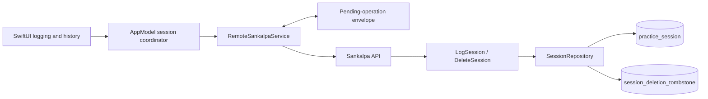

# Session Reliability and Correction — Architecture and Design

**Status:** Implemented
**Requirements:** [Sankalpa — Reliable Logging and Correction](../../requirements/sankalpa.md#reliable-logging-and-correction)
**Applies to:** `backend/` and the server-backed iOS app in `app/`

## 1. Purpose

Make one confirmed logging action produce at most one session across timeouts, retries, relaunches,
and reconnection. Give immediate, accurate feedback; require confirmation for a rapid additional
session; and support Undo and permanent deletion without allowing an earlier delayed request to
bring a deleted session back.

The design preserves two distinct ideas:

- Delivery retries of one logging action share one identity and have one effect.
- Separately confirmed logging actions have separate identities and remain separate sessions, even
  when their performed timestamps are identical.

There is no time-based server deduplication or uniqueness rule on session occurrence time.

## 2. Architecture



- `AppModel` owns in-flight and one-minute interaction policy across every manual and voice entry
  point.
- `RemoteSankalpaService` owns durable delivery, pending-state overlays, retry, and reconciliation.
- The backend owns final validation and idempotent create/delete effects.
- `PeriodOutcomeCalculator` continues to derive results from sessions that currently exist.

## 3. Stable Logging Identity

The app allocates a `SessionId` only after any rapid-repeat confirmation succeeds. That ID is also
the logging action's idempotency key and is reused for the initial request and every retry.

### 3.1 Create API

```http
POST /api/v1/sankalpas/{sankalpaId}/sessions
Idempotency-Key: <session UUID>
Content-Type: application/json

{"occurredAt":"2026-09-22T07:00:00"}
```

The first-party app always supplies a UUID `Idempotency-Key`. During compatibility transition the
backend accepts the header as absent and generates a new ID, preserving old installed clients;
such a legacy request is not eligible for replay by that client. An invalid supplied key is a
`400 INVALID_REQUEST`. The fallback is deprecated and should be removed once all supported clients
send the key.

Within one transaction the application service locks the parent sankalpa, then evaluates the key:

| Existing state for key | Request relationship | Result |
|---|---|---|
| Active session | Same sankalpa and `occurredAt` | `200` with the existing session; do not revalidate |
| Active session | Different sankalpa or `occurredAt` | `409 SESSION_IDENTITY_CONFLICT` |
| Deletion tombstone | Same sankalpa | `410 SESSION_DELETED`; never recreate |
| Deletion tombstone | Different sankalpa | `409 SESSION_IDENTITY_CONFLICT` |
| Neither | New action | Validate eligibility, insert once, return `201` |

The exact replay check precedes current lifecycle validation. A valid request may commit before its
response is lost; a later retry must return that session even if the sankalpa has since paused or
stopped.

Concurrent requests with the same key are also serialized by the parent lock and database primary
key. A uniqueness failure is resolved by rereading the key and applying the same replay/conflict
table rather than surfacing a generic storage error.

### 3.2 Delete API

```http
DELETE /api/v1/sankalpas/{sankalpaId}/sessions/{sessionId}
```

The delete use case returns `404 SANKALPA_NOT_FOUND` if the route's parent does not exist. Otherwise
it locks the parent sankalpa and performs one of these operations atomically:

- Matching active session: delete it and insert its tombstone.
- Matching tombstone: return success without change.
- No session or tombstone: insert a tombstone for the route's sankalpa and return success. This
  orders deletion ahead of an original create that may still arrive.
- Active session or tombstone belonging to another sankalpa: return
  `409 SESSION_IDENTITY_CONFLICT`.

Successful deletion returns `204`. The tombstone contains only `session_id` and `sankalpa_id`. It
is not soft-deleted session history, is never returned to users, and does not retain occurrence or
logging timestamps. It remains as long as a delayed delivery could exist; for this single-user
system that means no automatic expiry.

Both POST and DELETE use the same parent lock. If they overlap, the later transaction observes the
earlier transaction's active session or tombstone. Deletion therefore wins permanently once it is
accepted, regardless of request arrival order.

## 4. Backend Application and Persistence

`LogSession` accepts `SessionId`, `SankalpaId`, and `occurredAt`. `DeleteSession` accepts
`SankalpaId` and `SessionId`.

`SessionRepository` adds operations to:

- Find a session by ID.
- Delete a session by ID.
- Find and insert a deletion tombstone.

No update operation is added. Session content remains immutable while the session exists.

Deleting a session does not directly rewrite period data. Session totals, open periods, and closed
periods are recalculated from remaining sessions by the existing query and calculator paths.

## 5. Pending Operations on iPhone

Replace the create-only outbox JSON array with one versioned envelope:

```swift
struct PendingSessionOperations: Codable {
    var schemaVersion: Int = 2
    var creates: [PendingSession]
    var deletions: [PendingSessionDeletion]
    var recentLogs: [RecentSessionLog]
}

struct PendingSessionDeletion: Codable, Identifiable {
    let id: SessionId
    let sankalpaId: SankalpaId
    let requestedAt: Date
    let subtractsServerCount: Bool
    let suppressedRecentLog: RecentSessionLog?
}

struct RecentSessionLog: Codable {
    let sessionId: SessionId
    let sankalpaId: SankalpaId
    let completedAt: Date
}
```

`recentLogs` retains accepted or durably pending entries for at most one minute. Its timestamp is
an absolute instant so daylight-saving or timezone display changes do not lengthen the window. A
corresponding Undo, deletion, or rejected pending create removes that session's entry. Retaining
all still-active entries in the minute means undoing the newest does not hide an earlier rapid log
that should still trigger confirmation. This keeps the repeat guard correct across an app relaunch;
it is not session history.

The loader first decodes the new envelope, then falls back to the legacy `[PendingSession]` shape
and maps it to `creates`. The next mutation writes schema version 2. An unreadable envelope is set
aside under the existing damaged-outbox policy rather than overwritten.

Every change writes the entire envelope atomically. In particular, undoing a pending create removes
the create and inserts a deletion in one replacement, so a crash cannot leave both absent.

`subtractsServerCount` is `false` when Undo replaces a pending create: removing that create already
removes its local count, and the server may never have received it. It is `true` when deleting a
session known to be counted by the server, including an accepted receipt or a history row. This
distinction prevents both an optimistic count from surviving deletion and an uncertain create from
being subtracted twice.

When deletion suppresses an unexpired `RecentSessionLog`, that value moves into
`suppressedRecentLog` in the same atomic write. Successful deletion discards it. A rejected
deletion restores it only if its original one-minute window is still open, keeping the repeat guard
consistent with the restored session.

### 5.1 Local read overlay

The snapshot shown by the app is:

1. Server sessions,
2. plus pending creates,
3. minus IDs with pending deletions.

Lifetime counts add pending creates and subtract pending deletions whose
`subtractsServerCount == true`. This makes deletion locally effective as soon as its pending intent
is durably stored, including for an old session outside the bounded practice snapshot.

### 5.2 Synchronization order

One serialized synchronization pass:

1. Sends pending deletions oldest first.
2. Sends pending creates oldest first, reusing each create's `SessionId` as the idempotency key.
3. Refreshes the server snapshot.

Deletion goes first because it represents the user's latest intent. Undo removes the matching
pending create before synchronization, so the app does not knowingly create and then delete the
same session.

For either operation:

- A success response removes it from the envelope.
- `410 SESSION_DELETED` for a pending create also removes that create and its recent-log entry
  without an error: the later deletion intent has already won.
- An unreachable service retains it and stops the current synchronization pass.
- A rule or identity refusal removes it, reports the exact correction to the user, and refreshes
  authoritative state.

If a create response is lost after commit, retry returns the active session by ID. If a delete
response is lost after commit, retry returns `204` from the tombstone. Timestamp matching is
removed from reconciliation.

## 6. Application Interfaces

```swift
enum SessionDelivery: Sendable {
    case accepted
    case waitingToSync
}

struct SessionLogReceipt: Sendable {
    let sessionId: SessionId
    let sankalpaId: SankalpaId
    let occurredAt: CalendarMoment
    let delivery: SessionDelivery
}

enum SessionLogAttempt: Sendable {
    case logged(SessionLogReceipt)
    case rapidRepeatConfirmationRequired
    case alreadyInProgress
    case refused(SankalpaCommandError)
}

enum SessionDeletionAttempt: Sendable {
    case removed
    case waitingToSync
    case refused(SankalpaCommandError)
}
```

`RemoteSankalpaService.logSession` receives the generated `SessionId` and returns a receipt that
distinguishes accepted from durably pending. Before returning an accepted receipt, it merges the
response and authoritative count into the snapshot or completes a successful refresh, so a later
Undo can subtract exactly the session the user just saw. `AppModel` provides the interaction-level
command:

```swift
func logSession(
    _ sankalpaId: SankalpaId,
    occurredAt: CalendarMoment,
    rapidRepeatConfirmed: Bool = false
) async -> SessionLogAttempt

func deleteSession(
    _ sankalpaId: SankalpaId,
    sessionId: SessionId
) async -> SessionDeletionAttempt
```

Only `AppModel` decides whether a rapid-repeat confirmation is needed and whether a log for that
sankalpa is already in flight. All UI and voice paths call these interfaces rather than applying
their own timing rules.

## 7. Interaction Behavior

### 7.1 In-flight state

`AppModel` maintains a set of sankalpas with an active logging action. It inserts the ID before the
first suspension point and removes it with `defer`. Every log control for that sankalpa observes
the same state, becomes disabled immediately, and changes its label to “Logging…”. A second task
that reaches the model while the ID is present returns `alreadyInProgress`, performs no command,
and adds no competing feedback because the first action's progress remains visible.

### 7.2 One-minute repeat guard

Before generating a new `SessionId`, `AppModel` checks for any accepted or durably pending
completion for the same sankalpa within the prior minute. If one exists and
`rapidRepeatConfirmed == false`, it returns `rapidRepeatConfirmationRequired` without sending or
persisting a create.

The caller presents: “A session was just logged. Log another?” Cancel has no effect. Confirm calls
the same command with `rapidRepeatConfirmed == true`; a new ID is then generated and the additional
session remains distinct.

### 7.3 Result feedback and Undo

- Accepted: “Session logged.”
- Pending: “Session saved — waiting to sync.”
- Both confirmations show Undo for four seconds and retain the exact `SessionLogReceipt`.

Undo calls `deleteSession` with the receipt identity. For an accepted session this queues and sends
a deletion. For a pending or uncertain create it atomically replaces the create with a deletion.
The result is “Session undone” when finalized or “Deletion saved — waiting to sync” when pending.

Session history uses the backend's paginated, unfiltered session query so every logged session can
be reached. The current implementation follows every page during refresh, then merges pending
creates and filters pending deletion IDs in the local snapshot. Distinct session IDs prevent a
local overlay entry from collapsing a separately confirmed session at the same performed time.

Each history row exposes a trailing trash control and native swipe-to-delete, with a confirmation
naming the performed date and time and explaining that period results may change. A named
accessibility action reaches the same confirmation. There is no general session-editing flow.

The persistent offline notice reports creation and deletion counts separately, for example:
“1 session waiting to be sent · 1 deletion waiting to sync.”

## 8. Voice Integration

Voice continues to propose exactly one session and requires confirmation before execution. The
gateway calls the same `AppModel.logSession` interface:

- If no recent log exists, the existing proposal confirmation executes normally.
- If the gateway returns `rapidRepeatConfirmationRequired`, the assistant returns to the session
  review state with the warning “A session was just logged. Log another?” A second explicit
  confirmation calls with the override.
- Accepted and pending results carry the receipt so the result view can offer the same touch Undo.

Undo is a touch correction from the result state; spoken edit/delete commands remain outside the
voice feature's first release.

## 9. Failure Semantics

| Failure point | Visible state | Durable state | Next action |
|---|---|---|---|
| Create cannot reach service | Session included as pending | Pending create | Retry with same ID |
| Create committed, response lost | Session included as pending | Pending create | Replay returns existing session |
| Pending create later refused | Session removed; user informed | Create removed | Refresh authoritative practice |
| Pending create meets its deletion tombstone | Session remains removed | Create and recent-log entry removed | No warning; deletion already won |
| Delete cannot reach service | Session excluded as pending deletion | Pending deletion | Retry delete |
| Delete committed, response lost | Session remains excluded | Pending deletion | Replay returns `204` |
| Pending deletion later refused | Session restored if authoritative; user informed | Deletion removed | Refresh authoritative practice |
| Pending envelope write fails | No success or removal is reported | Previous envelope remains | Show storage failure |
| Idempotency key conflicts | No local success | Conflicting operation removed or never queued | Show conflict and refresh |

## 10. Verification

### Backend

- Exact replay returns the same session and one row.
- Replay after Pause or Stop does not revalidate or duplicate.
- Same key with different content returns `409` without mutation.
- Different keys at the same `occurredAt` create distinct sessions.
- Concurrent exact requests create one row.
- Delete is idempotent and atomically records a tombstone.
- Delete-before-create and create-before-delete both end deleted.
- Deleted sessions disappear from totals and recalculate open and closed outcomes.

### iOS storage and service

- Legacy outbox arrays migrate without data loss.
- Create-to-delete replacement is atomic and survives relaunch.
- Lost create and delete responses retry safely by ID.
- Pending deletions hide sessions and adjust counts.
- Paginated history reaches and deletes sessions older than the bounded practice snapshot.
- Rejections restore authoritative state and produce one notification.
- A rejected deletion restores an unexpired repeat guard that it had suppressed.
- Corrupt pending-operation data follows the existing preserve-and-report policy.

### Interaction and voice

- Double tap during an active request executes once.
- A repeat within one minute prompts; cancel keeps one and confirm creates two.
- The repeat guard survives relaunch for the remaining part of the minute.
- Accepted and pending text is accurate and Undo targets the exact session.
- History deletion confirms, works with accessibility actions, and changes affected outcomes.
- Voice rapid repeat requires the warning confirmation and offers touch Undo afterward.

## 11. Implementation Order

1. Add backend lookup, tombstone persistence, stable-key create behavior, and idempotent DELETE with
   integration tests.
2. Migrate the iOS pending store to the versioned create/delete envelope and replace timestamp
   reconciliation with ID reconciliation.
3. Return `SessionLogReceipt`, add shared in-flight and repeat policy in `AppModel`, and update all
   manual logging surfaces.
4. Add Undo, session-history deletion, pending-deletion overlays, and offline status text.
5. Integrate the voice gateway and result state with repeat confirmation and Undo.
6. Run backend, package, app, and UI suites plus the offline lost-response journeys.
