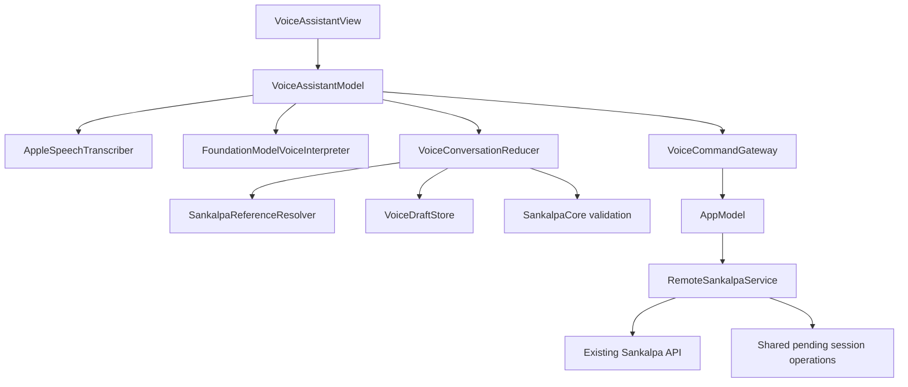

# Conversational Voice — Architecture and Design

**Status:** Implemented; session-reliability integration proposed  
**Requirements:** [Conversational voice](../../requirements/conversational-voice.md)  
**Related design:** [Session reliability and correction](../session-reliability/README.md)  
**Applies to:** The server-backed iOS app in `app/`

## 1. Purpose

Add an in-app conversational voice experience that lets the user:

1. Log one session for an existing Sankalpa.
2. Prepare, review, revise, and declare one new Sankalpa.

The user speaks naturally. The app interprets each completed utterance, maintains a deterministic
conversation state, shows the exact proposed action, and changes the practice only after explicit
confirmation.

This feature is a new driving adapter over the existing application. It does not change the
Sankalpa domain, duplicate its rules, or give a language model authority to perform commands.

## 2. Scope decisions

### Included

- User-initiated, in-app voice capture.
- On-device speech-to-text.
- On-device interpretation of free-form language into constrained Swift values.
- Spoken clarification, revision, confirmation, and cancellation.
- A visible, editable transcript for each utterance.
- A visible proposal before every command.
- One persisted declaration draft.
- Shared reliable online/offline session logging, repeat confirmation, and touch Undo behavior.
- Deterministic result messages that distinguish accepted, pending, draft-only, and not-saved.

### Excluded

- Continuous or background listening.
- Siri and App Intents.
- MCP, an autonomous agent, or language-model tool calling.
- A cloud language model or server-side transcription.
- Voice-specific backend endpoints. Voice uses the shared session APIs.
- Voice lifecycle commands, spoken session editing/deletion beyond the required touch Undo, or
  multiple commands from one confirmation.
- Generated advice about whether a commitment is wise or achievable.
- Spoken responses in the first release. All app responses are visible as text; speech output can
  be added later without changing the conversation model.

## 3. Platform decision

The existing app keeps its current iOS 18 deployment target. The voice feature is available on
iOS 27 or later when all of the following are ready:

- Microphone permission is granted.
- The current locale is supported by `SpeechTranscriber`.
- Required speech assets are installed.
- `SystemLanguageModel.default` is available and supports the current locale.

This covers the intended iPhone 17 Pro without raising the minimum OS for the rest of the app.
There is no cloud fallback. If a local capability is unavailable, the app explains the specific
reason and leaves the existing manual flows available.

The feature uses `SpeechAnalyzer` with `SpeechTranscriber`; Apple documents that these transcriber
modules do not send the user's audio to Apple servers. `FoundationModels` interpretation also uses
the on-device system model. See [SpeechAnalyzer](https://developer.apple.com/documentation/speech/speechanalyzer),
[speech-recognition privacy](https://developer.apple.com/documentation/speech/asking-permission-to-use-speech-recognition),
and [SystemLanguageModel](https://developer.apple.com/documentation/foundationmodels/systemlanguagemodel).

## 4. Architectural shape



Dependencies point inward:

- SwiftUI owns presentation only.
- Apple speech and language frameworks are adapters.
- `VoiceConversationReducer` owns conversation rules and has no Apple-framework dependency.
- `SankalpaCore` remains the source of commitment, lifecycle, declaration, and session rules.
- `AppModel` remains the app's command boundary.
- `RemoteSankalpaService` remains the only path to the service and the shared pending-operation
  store.

The model never receives a network client, repository, `AppModel`, or executable tool.

## 5. Components

### 5.1 `VoiceReadiness`

Checks the feature prerequisites when the user opens the voice assistant. It reports one of:

- `ready`
- `microphonePermissionNeeded`
- `microphoneDenied`
- `unsupportedOS`
- `unsupportedLocale`
- `speechAssetsNeeded`
- `languageModelDisabled`
- `languageModelNotReady`

Microphone permission is requested only after the user chooses to start listening. Missing speech
assets may be installed with visible progress when connectivity permits. An unavailable language
model or missing assets never causes a switch to a cloud service.

Only `NSMicrophoneUsageDescription` is required. The design does not use `SFSpeechRecognizer`, so
it does not request permission for server-backed speech recognition. Audio recording permission is
requested through `AVAudioApplication`.

### 5.2 `AppleSpeechTranscriber`

`AppleSpeechTranscriber` conforms to a small protocol:

```swift
public protocol VoiceTranscribing: Sendable {
    func start(locale: Locale) async throws -> AsyncThrowingStream<VoiceTranscriptUpdate, Error>
    func finish() async throws -> String
    func cancel() async
}

public struct VoiceTranscriptUpdate: Sendable, Equatable {
    public let text: String
    public let isFinal: Bool
}
```

The adapter uses one `SpeechAnalyzer`, one `SpeechTranscriber`, and one
`CaptureInputSequenceProvider` for the current utterance. Partial results update the visible
transcript. Only final results can be interpreted. Apple exposes finalization through
`SpeechTranscriber.Result.isFinal`; see
[SpeechTranscriber.Result](https://developer.apple.com/documentation/speech/speechtranscriber/result).

The adapter:

- Starts capture only from an explicit user action.
- Keeps audio in the capture pipeline rather than writing an audio file.
- Stops and finalizes when the user explicitly stops listening.
- Cancels immediately when the user cancels, dismisses the assistant, or the app leaves the
  foreground.
- Releases the capture provider and analyzer after finalization or cancellation.
- Runs at most one transcription at a time.
- Propagates capture and analysis failures through the throwing result stream.

The transcript is ordinary text after finalization. Correcting it and choosing Apply sends the
corrected text through interpretation again; it does not reuse the prior interpretation.

### 5.3 `FoundationModelVoiceInterpreter`

The interpreter converts one final utterance into a private `GeneratedVoiceTurn` using Foundation
Models guided generation, validates and maps it, and returns a platform-neutral
`InterpretedTurn`. Apple describes `@Generable` output as constrained sampling that guarantees the
response shape, not the semantic correctness of its values. Every value is therefore checked
after generation. See
[guided generation](https://developer.apple.com/documentation/foundationmodels/generating-swift-data-structures-with-guided-generation).

The generated shape contains only interpretation data:

```swift
@Generable
private struct GeneratedVoiceTurn: Sendable {
    var intent: GeneratedVoiceIntent
    var sankalpaReference: String?
    var datePhrase: String?
    var timePhrase: String?
    var year: Int?
    var month: Int?
    var day: Int?
    var hour: Int?
    var minute: Int?
    var changedDraftFields: [GeneratedDraftField]
    var title: String?
    var descriptionText: String?
    var clearDescription: Bool
    var actionType: GeneratedActionType?
    var startYear: Int?
    var startMonth: Int?
    var startDay: Int?
    var periodUnit: GeneratedPeriodUnit?
    var timesPerPeriod: Int?
    var durationCount: Int?
    var durationUnit: GeneratedPeriodUnit?
    var clearDuration: Bool
}

@Generable
private enum GeneratedVoiceIntent: Sendable {
    case logSession
    case updateDeclaration
    case confirm
    case cancel
    case resumeDraft
    case discardDraft
    case unsupported
}
```

`GeneratedVoiceTurn` and its generated enums exist only inside the Foundation Models adapter. The
adapter maps them into plain `InterpretedTurn`, `VoiceIntent`, and `DraftField` values before
returning. The reducer and its tests therefore do not import or reference FoundationModels.

The concrete schema may split nested values for clarity, but it keeps these properties:

- Intent is one of the supported conversational transitions.
- A spoken Sankalpa reference is text, never a generated identifier.
- Date and time preserve the original phrases as well as proposed components.
- `changedDraftFields` identifies the only draft fields a turn may change.
- `clearDescription` and `clearDuration` distinguish an explicit removal from an omitted value.

The interpreter receives:

- The final or corrected utterance.
- The current local date and time.
- The current draft, if any.
- The current clarification question, if any.
- Candidate titles only when the preceding turn needs title disambiguation.

It does not receive session history or the entire practice. A new `LanguageModelSession` is used
for each turn. The coordinator, not the model transcript, owns conversational memory. This keeps
the prompt bounded and prevents a long model transcript from becoming a second source of state.

The bundled, versioned prompt instructs the model to:

- Interpret only the two supported interactions and conversational controls.
- Return only fields supported by the utterance and current clarification.
- Never invent a clock time for phrases such as "this morning" or "after lunch."
- Treat "today" without a time as a date-only expression; the reducer applies the required default.
- Mark only explicitly changed draft fields.
- Never convert a duration into a different period unit.
- Never claim that a command was performed.

The prompt is a versioned app resource, not downloaded configuration, so interpretation works
without server connectivity. Prompt changes require the evaluation suite described below.

### 5.4 `VoiceConversationReducer`

The reducer is deterministic. It accepts the current `VoiceConversationState`, one
`InterpretedTurn`, the current practice snapshot, and the app clock. It returns a new state and at
most one side effect request.

The reducer is the authority on:

- Which conversational transitions are legal.
- Which draft fields change.
- Whether clarification is required.
- Whether a proposal is complete.
- Whether confirmation applies to the proposal currently shown.
- Whether a command may be requested.

It ignores generated values for fields absent from `changedDraftFields`. It never accepts a model
generated Sankalpa identifier or success message.

For optional fields, the reducer clears a value only when that field is listed in
`changedDraftFields` and its matching `clear` flag is true. A missing generated value never clears
an existing draft value by itself.

Each complete proposal receives a new `proposalID`. Any revision replaces the proposal and its ID.
A confirmation can execute only the currently displayed ID. While execution is in progress,
additional confirmations are ignored. This prevents partial transcripts, repeated "yes" results,
and double taps from executing a command twice.

### 5.5 `SankalpaReferenceResolver`

The resolver matches the spoken reference against the current `AppModel.summaries`, including
terminal Sankalpas because an eligible past session may be backfilled after completion or stop.

Matching is deterministic and tiered:

1. Case-, whitespace-, punctuation-, and diacritic-insensitive exact title match.
2. Whole-word containment between the spoken reference and title.

Only the highest matching tier is considered. One result resolves. Zero results reports no match.
Multiple results produce a clarification listing those titles. There is no unbounded fuzzy match
and the language model never chooses among multiple results.

The answer to a title clarification is resolved only against the listed candidates.

### 5.6 Date, time, and declaration validation

Generated calendar components are converted to `CalendarDay` and `CalendarMoment` and rejected if
they do not form valid values.

For session time:

- An explicit date and time becomes the proposal time.
- "Today" without a time becomes `AppModel.now()`.
- Any other date without an exact time requires clarification.
- An approximate phrase without an exact clock time requires clarification.
- A future or otherwise ineligible moment is refused through the existing domain behavior.

For a declaration draft:

- Title, action type, start date, period, and times per period must be present.
- Description and duration remain optional.
- A supplied duration is retained as a count and unit.
- If duration unit differs from the chosen period, the reducer asks for a whole number of the
  chosen period. It does not calculate or silently apply a conversion.
- Values are mapped into the existing `Declaration` and checked with existing `SankalpaCore`
  value and aggregate rules before a declaration proposal is shown.
- The server remains authoritative when the command is finally submitted.

When several required values are missing, clarification follows this stable order: title, action
type, start date, period, and number of times. A duration-unit mismatch is asked after the required
values. This order affects only follow-up questions; the user may provide fields in any order and
may provide several in one utterance.

### 5.7 `VoiceDraftStore`

The store persists one `VoiceDeclarationDraft` as compact, versioned JSON in Application Support:

```swift
public struct VoiceDeclarationDraft: Codable, Sendable, Equatable {
    public var schemaVersion: Int
    public var id: UUID
    public var revision: Int
    public var title: String?
    public var descriptionText: String?
    public var actionType: ActionType?
    public var startDate: CalendarDay?
    public var periodUnit: PeriodUnit?
    public var timesPerPeriod: Int?
    public var duration: VoiceDuration?
}

public struct VoiceDuration: Codable, Sendable, Equatable {
    public var count: Int
    public var unit: PeriodUnit
}
```

The store is separate from the practice cache and pending session operations because a draft is
neither a server snapshot nor a performed fact. It uses atomic replacement after every accepted
draft change. It deletes the file only after successful declaration or explicit discard.

If a write fails, the app keeps the in-memory draft but reports that it was not saved. It cannot
describe that draft as preserved for later. If a stored draft cannot be decoded, the original file
is set aside and the user is told that the draft could not be restored; it is not silently
overwritten.

The coordinator records the latest successfully persisted draft revision. If the service is
unavailable after declaration confirmation, it reports “Draft saved” only when the current
revision is persisted. Otherwise it reports that the action was not saved. A failed discard keeps
the draft visible and reports the failure rather than pretending it is gone.

Starting a new declaration while a draft exists first presents Resume and Discard. Discard is an
explicit reducer transition. Cancelling or dismissing the assistant preserves the draft.

The raw transcript and model transcript are not persisted. Only the structured draft survives an
app relaunch.

### 5.8 `VoiceCommandGateway`

The voice package defines an app-facing protocol; the iOS target implements it through `AppModel`:

```swift
@MainActor
public protocol VoiceCommandGateway: AnyObject {
    var voicePracticeSnapshot: VoicePracticeSnapshot { get }
    func logSessionForVoice(
        _ id: SankalpaId,
        occurredAt: CalendarMoment,
        rapidRepeatConfirmed: Bool
    ) async -> VoiceSessionExecution
    func undoSessionForVoice(
        _ receipt: VoiceSessionReceipt
    ) async -> VoiceSessionCorrectionExecution
    func declareForVoice(
        _ declaration: Declaration
    ) async -> VoiceDeclarationExecution
}

public enum VoiceSessionExecution: Sendable {
    case acceptedByService(VoiceSessionReceipt)
    case pendingOnDevice(VoiceSessionReceipt)
    case rapidRepeatConfirmationRequired
    case refused(String)
    case notSaved(String)
}

public struct VoiceSessionReceipt: Sendable, Equatable {
    public let sessionId: SessionId
    public let sankalpaId: SankalpaId
    public let occurredAt: CalendarMoment
}

public enum VoiceSessionCorrectionExecution: Sendable {
    case removed
    case pendingOnDevice
    case refused(String)
    case notSaved(String)
}

public enum VoiceDeclarationExecution: Sendable {
    case acceptedByService
    case serviceUnavailable(String)
    case refused(String)
    case notSaved(String)
}
```

`VoicePracticeSnapshot` contains the current summaries, local clock value, whether any practice
has ever been loaded, and whether the latest refresh reached the service. Those status fields let
the coordinator distinguish “no title matched” from “there is no cached practice to verify while
offline.” It does not expose repositories or mutation methods.

The shared `AppModel.logSession` path exposes whether its successful result was accepted by the
service or retained as pending and returns the exact session receipt. It also owns the in-flight
guard and one-minute repeat policy. Voice does not duplicate those rules.

The first confirmed proposal calls with `rapidRepeatConfirmed == false`. If the gateway reports a
rapid repeat, the coordinator returns to the same proposal with an explicit additional-session
warning. Only a second confirmation calls with `true`. The coordinator retains the active proposal
and proposal ID across this check so a late outcome cannot execute a revised proposal.

Accepted and pending results expose a touch Undo action backed by the receipt. Spoken session
editing and deletion remain outside this release.

Declaration has no offline outbox. If the service is unavailable, the persisted draft remains and
the confirmation is consumed. The next attempt must show the proposal and obtain confirmation
again. On success, the draft is deleted only after the service accepts the declaration.

### 5.9 `VoiceAssistantModel` and view

`VoiceAssistantModel` is a `@MainActor`, observable coordinator used by `VoiceAssistantView`. It:

- Owns the visible conversation state.
- Starts and cancels transcription and interpretation tasks.
- Sends interpreted turns through the reducer.
- Applies draft-store effects.
- Executes gateway effects.
- Maps outcomes into deterministic user-facing text.

`VoiceAssistantView` is presented from one app-level microphone control owned by `RootView`, so the
conversation does not belong to a particular tab. The control is outside `RootView`'s
tabs-versus-recovery conditional and therefore remains available when the service has never loaded
and the recovery screen is visible. If a saved draft exists, the control indicates that a draft is
waiting; opening it presents Resume and Discard before a new declaration can begin.

The sheet contains only state-driven elements:

- Readiness or permission message.
- App question or result.
- Live transcript and correction control.
- Session or declaration proposal.
- Start/stop listening, Apply correction, Confirm, Undo, and Cancel controls as applicable.

All controls have text accessibility labels. Voice is additive; every operation also has a touch
control, and the existing manual screens remain available.

## 6. Conversation state machine

```swift
public enum VoiceConversationState: Sendable, Equatable {
    case unavailable(VoiceUnavailableReason)
    case idle(savedDraft: VoiceDeclarationDraft?)
    case choosingSavedDraft(VoiceDeclarationDraft)
    case listening(Context)
    case interpreting(Context, transcript: String)
    case clarifying(Context, question: Clarification)
    case reviewingSession(VoiceSessionProposal)
    case editingDeclaration(VoiceDeclarationDraft, nextQuestion: Clarification?)
    case reviewingDeclaration(VoiceDeclarationProposal)
    case executing(ProposalID)
    case result(VoiceResult, savedDraft: VoiceDeclarationDraft?)
}
```

Key transitions:

| Current state | Input | Next state |
|---|---|---|
| Idle | Start listening | Listening |
| Listening | Final transcript | Interpreting |
| Interpreting | Incomplete log request | Clarifying |
| Interpreting | Complete log request | Reviewing session |
| Interpreting | Declaration patch | Editing or reviewing declaration |
| Clarifying | Spoken answer | Interpreting with the clarification context |
| Reviewing | Spoken or tapped revision | Interpreting |
| Reviewing | Spoken or tapped confirmation | Executing current proposal ID |
| Any non-executing state | Cancel interaction | Idle; retain a declaration draft |
| Choosing saved draft | Resume | Editing declaration |
| Choosing saved draft | Discard | Idle after persistent deletion succeeds |
| Executing session | Rapid-repeat outcome | Reviewing the same session with an additional-session warning |
| Executing | Accepted, pending, refused, or not-saved outcome | Result |

There is no transition from a model response directly to Executing. The reviewing state is always
entered first.

## 7. Primary flows

### 7.1 Log a session

1. User starts listening and speaks freely.
2. Final transcript is shown and interpreted.
3. Resolver finds zero, one, or multiple title matches.
4. Missing or ambiguous title/time produces one clarification.
5. A complete proposal shows the resolved title and exact local date/time.
6. User confirms by voice or touch.
7. Gateway checks the shared in-flight and one-minute repeat policy.
8. A rapid repeat returns to review with “A session was just logged. Log another?”; confirmation
   then executes one new logging action.
9. Result says either accepted by the service, saved on the phone and waiting, refused, or not
   saved, and accepted or pending results offer touch Undo.

The voice feature never begins or resumes a Sankalpa to make the session eligible.

### 7.2 Prepare and declare a Sankalpa

1. User describes the commitment in any order.
2. Interpreter returns a patch; reducer applies only named changed fields.
3. Draft is atomically persisted.
4. The next missing or incompatible field is requested.
5. Once complete and locally valid, a proposal shows every required field and any optional values.
6. Revisions create a new proposal ID and require another review.
7. Explicit confirmation calls the existing declaration command once.
8. Accepted declaration deletes the draft. Refusal leaves it available for revision. Service
   unavailability leaves it saved but not declared.

Declaration does not begin the Sankalpa.

### 7.3 Service unavailable

Speech, interpretation, draft updates, and review continue because they do not use the Sankalpa
service.

For session logging, the shared command attempts the service and then performs cached domain
validation and durable pending-operation storage when unreachable. A successful offline result is
reported as pending, not accepted by the service. The stable session identity is reused when it is
sent later.

For declaration, the app retains the draft and reports that it has not been declared. It does not
queue the declaration. When the user later resumes the draft, a fresh proposal and confirmation
are required before another service attempt.

If there is no cached Sankalpa matching a log request, the app says it cannot verify the Sankalpa
while the service is unavailable. It does not invent or queue an unresolved session.

## 8. App and task lifecycle

- Only one listen or interpret task can be active.
- Starting a new listen cancels any superseded transcription or interpretation task.
- Moving the app out of the foreground stops microphone capture immediately.
- A finalized transcript remains editable after capture stops.
- Dismissing the assistant cancels transient work, discards a session proposal, and retains a
  declaration draft.
- A late result from a cancelled task carries an operation token and is ignored.
- App activation continues to call `AppModel.refresh()`, which flushes pending session creations
  and deletions and reports authoritative rejections through the global mechanism.

## 9. Error and result mapping

The model does not generate user-facing success or refusal text. The coordinator maps known states:

| Condition | Required result |
|---|---|
| Service accepted session | “Session logged.” and touch Undo |
| Session retained as pending | “Session saved on this iPhone and waiting to sync.” and touch Undo |
| Rapid repeat | Return to the proposal with “A session was just logged. Log another?” |
| Undo retained as pending | “Removed on this iPhone — waiting to sync.” |
| Service accepted declaration | “Sankalpa declared.” |
| Declaration service unavailable | “Draft saved. This Sankalpa has not been declared.” |
| Draft persistence failed | “This draft could not be saved.” |
| Domain or server refusal | Existing `SankalpaCommandError.message` |
| No cached practice for offline log | “This Sankalpa cannot be verified while the service is unavailable.” |
| Unsupported request | “Voice currently supports logging one session or preparing one new Sankalpa.” |
| Transcription or interpretation failure | Keep transcript and offer Retry or manual correction. |

These are state descriptions, not conversational model output.

## 10. Privacy and data handling

- Audio is captured only while the visible listening state is active.
- Audio is not written to a file or application log.
- Audio buffers are released after finalization or cancellation.
- Speech and interpretation stay on device.
- Raw and model transcripts are not persisted or logged.
- The structured declaration draft is the only new persisted voice data.
- Shared pending session creations, deletions, and recent-log guard data follow the session
  reliability design; voice adds no separate persisted command state.

## 11. Source layout

Add one testable library target and a small UI adapter:

```text
app/SankalpaCore/Sources/SankalpaVoice/
  Conversation/
    VoiceConversationState.swift
    VoiceConversationReducer.swift
    VoiceModels.swift
    SankalpaReferenceResolver.swift
  Interpretation/
    VoiceInterpreting.swift
    FoundationModelVoiceInterpreter.swift
    voice-interpreter-v1.txt
  Speech/
    VoiceTranscribing.swift
    AppleSpeechTranscriber.swift
    VoiceReadiness.swift
  Persistence/
    VoiceDraftStore.swift
  Gateway/
    VoiceCommandGateway.swift

app/SankalpaCore/Tests/SankalpaVoiceTests/
  ConversationReducerTests.swift
  ReferenceResolverTests.swift
  DraftStoreTests.swift
  InterpreterFixtureTests.swift

app/Sankalpa/UI/Voice/
  VoiceAssistantModel.swift
  VoiceAssistantView.swift
  VoiceProposalViews.swift
  AppModel+VoiceCommandGateway.swift
```

`SankalpaVoice` depends on `SankalpaCore`, Foundation, Speech, AVFAudio, and FoundationModels. It
does not depend on SwiftUI or `SankalpaStorage`. The iOS app target supplies `AppModel` as the
gateway and presents the SwiftUI view.

`Package.swift` declares `voice-interpreter-v1.txt` as a processed resource of the
`SankalpaVoice` target and adds a `SankalpaVoiceTests` test target. No prompt text is hard-coded in
the coordinator.

Apple-framework adapters are availability-gated to iOS 27. Reducer, resolver, persistence, and
gateway types remain ordinary Swift and are testable without speech capture or a language model.

## 12. Verification strategy

### Deterministic tests

Use fake transcriber, interpreter, clock, draft store, and gateway implementations to cover:

- No execution from partial speech.
- Spoken and touched confirmation use the same transition.
- Revision invalidates prior confirmation.
- Repeated confirmation executes once.
- Rapid-repeat outcome returns to review and requires a second explicit confirmation.
- Accepted and pending receipts target the exact session for touch Undo.
- Zero, one, and multiple title matches.
- Terminal Sankalpa backfill remains resolvable.
- Today without time resolves to now.
- Other dates without time and approximate times require clarification.
- Invalid/future session times are refused.
- Draft patches change only named fields.
- Required declaration fields and duration-unit mismatch.
- One saved draft, resume, discard, cancellation, and relaunch.
- Atomic write failure and unreadable stored draft.
- Accepted, pending, draft-only, refused, and not-saved results.
- Service unavailable with and without a usable cached practice.

### Prompt evaluation

Maintain a fixture set of natural utterances and the allowed structured interpretation. Include:

- Direct, indirect, and reordered requests.
- Corrections and follow-up answers.
- Sankalpa vocabulary such as Vipassana and Sudarshan Kriya.
- Ambiguous titles and approximate times.
- Unsupported lifecycle and multi-action requests.
- Attempts to instruct the model to bypass confirmation or perform an unsupported action.
- Initial phrases such as “create a new Sankalpa” never count as confirmation of a later proposal.

Evaluation checks intent, changed-field set, extracted reference, and temporal components. It does
not require exact generated prose because the model produces no user-facing prose. Run the suite
on the supported physical device and again when the OS model changes. Apple explicitly recommends
retesting prompts across model updates; see
[updating prompts](https://developer.apple.com/documentation/foundationmodels/updating-prompts-for-new-model-versions)
and [prompt evaluation](https://developer.apple.com/documentation/foundationmodels/evaluating-prompts-to-measure-performance-and-improve-model-responses).

### UI and device checks

- First microphone permission request, denial, and later Settings recovery.
- Speech asset and language-model unavailable states.
- Live partial transcript followed by one final interpretation.
- Manual transcript correction.
- Audio interruption and backgrounding.
- Online and offline session result wording.
- Rapid-repeat warning and second confirmation.
- Touch Undo for accepted and pending voice logs.
- Offline draft, relaunch, resume, reconnect, review, and declare.
- Dynamic Type, VoiceOver labels, Dark Mode, and portrait layouts.

Real audio is limited to device checks. Most regression coverage injects final transcript strings,
which keeps tests fast and stable.

## 13. Requirement traceability

| Requirement area | Design coverage |
|---|---|
| Natural speech, no fixed phrases | On-device free-form interpreter; no command grammar |
| Voice clarification/revision/confirmation/cancel | Reducer transitions accept interpreted spoken controls |
| Visible and correctable transcript | Speech adapter and assistant view |
| No action during speech | Only final transcript enters interpretation |
| Audio not retained | In-memory capture, immediate release, no audio file |
| Clarification and no silent ambiguity | Reducer, title resolver, temporal validation |
| Explicit confirmation | Proposal ID and mandatory reviewing state |
| One session | Single session proposal and one gateway effect |
| Retry does not duplicate | Shared stable session identity and idempotent delivery path |
| Rapid additional session | Gateway outcome returns to warned review before a new action |
| Immediate Undo | Receipt-backed touch action from the result state |
| New Sankalpa draft and revision | Persisted `VoiceDeclarationDraft` and patch reducer |
| One unfinished draft | Store cardinality and Resume/Discard state |
| Whole-period duration | Unit comparison before proposal |
| Declaration does not begin | Gateway exposes declaration only |
| Offline draft | Local draft store; no declaration queue |
| Offline session | Existing cache validation and shared pending-operation store with explicit pending outcome |
| Four result statuses | Deterministic execution outcome mapping |
| Unsupported actions | Interpreter schema, reducer rejection, and fixed explanation |

## 14. Implementation sequence

1. Add `SankalpaVoice` types, reducer, draft store, gateway protocol, and deterministic tests.
2. Integrate the shared receipt, accepted-versus-pending disposition, in-flight guard, rapid-repeat
   outcome, and Undo gateway from the session-reliability design.
3. Add Foundation Models interpreter and prompt fixtures.
4. Add SpeechAnalyzer adapter and readiness checks.
5. Add `VoiceAssistantModel`, view, and app-level entry point.
6. Add UI/device journeys and run the prompt evaluation suite on the iPhone 17 Pro.

Voice adds no backend endpoint of its own. It depends on the shared idempotent logging and session
deletion API changes described by the session-reliability design.

## 15. Implementation status

The original implementation lives in the source layout above. The package test suite covers the reducer,
title resolution, draft durability, confirmation idempotence, temporal clarification, duration
compatibility, offline verification, and accepted-versus-pending command disposition. The app
build verifies both simulator architectures while preserving the iOS 18 deployment target.

Speech recognition and interpretation require iOS 27, installed on-device speech assets, a
supported locale, microphone permission, and an available System Language Model. Real speech and
prompt-quality evaluation remain physical-device checks because the simulator does not provide a
usable on-device language model. The deterministic suites inject interpreted turns and therefore
remain fast, repeatable, and independent of model availability.

Receipt-backed Undo and rapid-repeat integration remain pending until the shared
session-reliability design is implemented.
